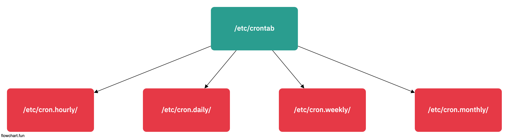

# CRON + AT

## CRON



- 주기적으로 반복되는 시스템작업

```sh
    ## Cron 위치
    cd /etc/crontab

    ## Cron 잘 동작하는지 확인
    sudo systemctl status crond

    ## 실행파일 만들기
    touch monthly.backup.sh
    mv monthly.backup.sh /usr/local/bin

    ## 크론탭 구성
    crontab -e

    ## 일단 매분마다 실행하게끔 구성
    * * * * * root run-parts /usr/local/bin/monthly.backup.sh

    ## cron 로그확인하기
    tail -f /var/log/cron
```
