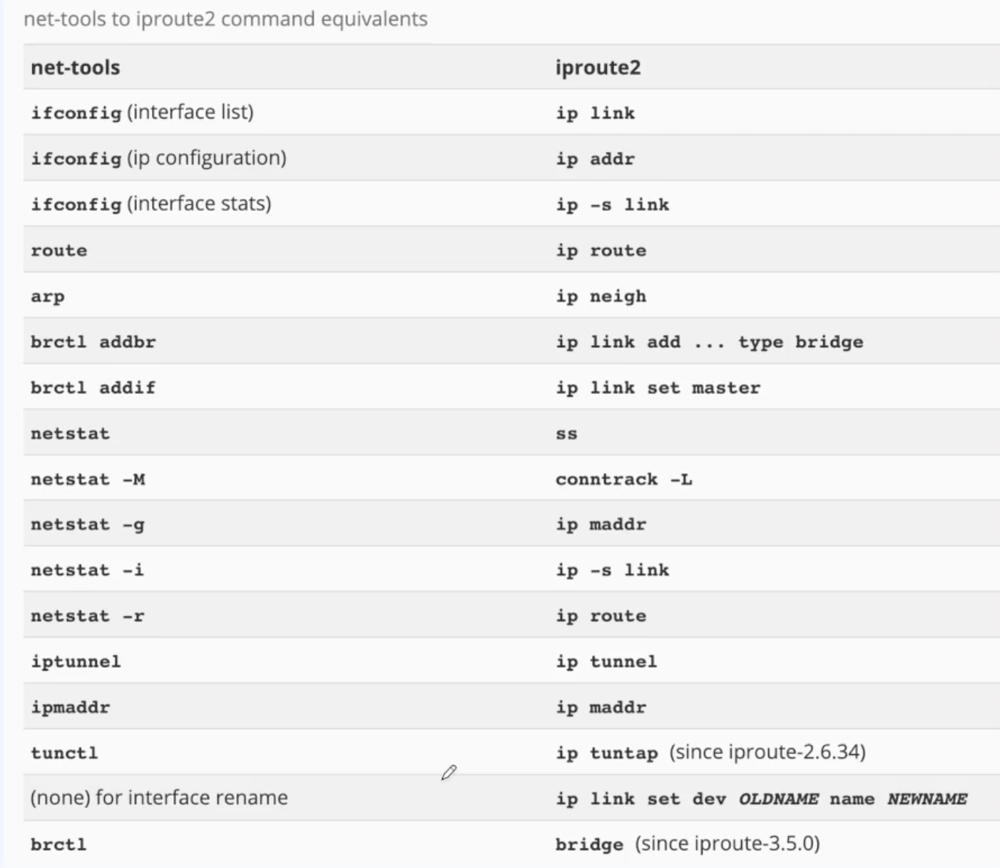

# 리눅스 네트워크

## use hosts

- 호스트명과 IP 주소를 매핑하는 방법
- IP 주소와 이름을 명세

```sh
    cat /etc/hosts
    sudo vi /etc/hosts

    ## get fastcampus ip
    nslookup fastcampus.co.kr

    ## fastcampus ip = naver.com
    [fast_campus_ip] naver.com

    curl --insecure https://naver.com | grep "<title>"

    ## naver.com으로 입력하면 fastcampus로 들어감
```

## use resolve.conf

- DNS 구성
- DNS 도메인들과 이름 검색을 위해 사용할 네임서버 주소를 나열
- 네임서버 맨위에서부터 Mapping

## ip 찾기



- ifconfig 이제는 안씀
- iproute2를 사용하는 것이 좋음

```sh
    ## ip [command] + ss [command]

    ## network 인터페이스
    ip addr

    ip addr show eth0

    ## netstat 대체
    sudo ss -tulpn | grep 80
```
