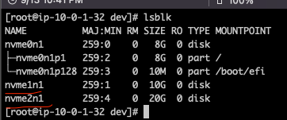
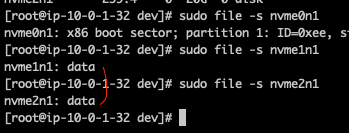
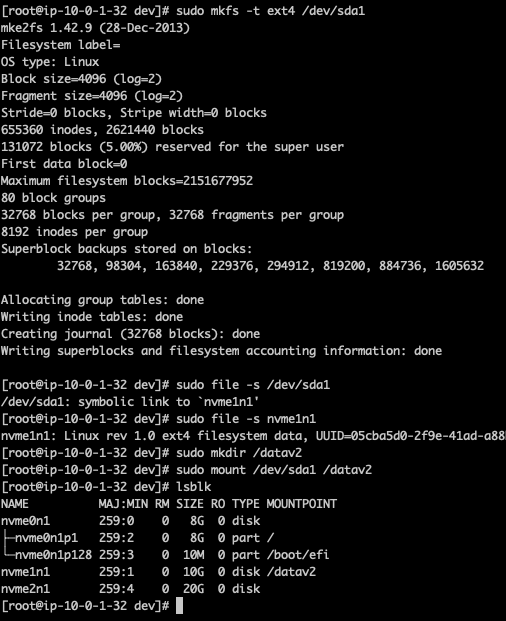
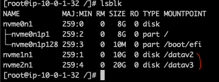
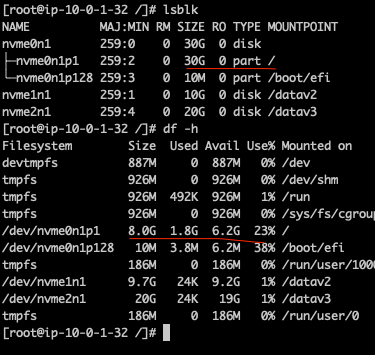
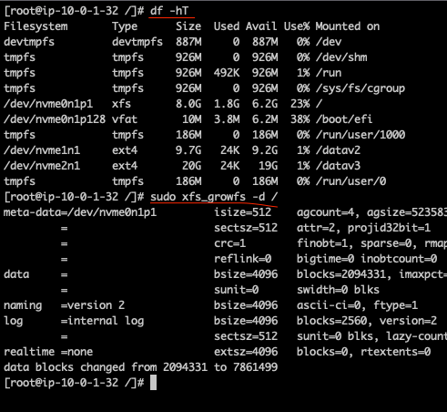

# Disk

## 파일시스템

- 스토리지장치에 파일을 명령/저장/읽어내는 시스템

## 디스크기반 파일 시스템

- Linux => EXT3, EXT4, ZFS, BTRFS
- Windows => FAT, NTFS
- MacOS => HFS, APFS

## 네트워크 파일시스템

- NFS, SMB, CIFS

## 특수파일 시스템 (특수목적의 소량의 용량)

- prod, sysfs, tmpfs, cgroup

## 실습

- [x] 디스크 사용량 측정하는 Script
- [x] 디스크 사용량이 어느정도 찼을때 Slack 알림

  - <a href="https://jojoldu.tistory.com/552"> Slack hook 추가 </a>

    ```sh
        cat <<EOF > disk_check_cron
        ...
        EOF
    ```

  - CronTab 설정

    ```sh
        */30 * * * * /usr/local/bin/volume_check_script.sh

        crontab -e
    ```

- [x] 디스크 마운트

  - AWS EC2 Console에서 EC2 EBS 볼륨 생성후 -> 연결
  - EC2 터미널에서 디바이스 상태 및 파일시스템 존재 벼우 확인

    

  - 현재 파일시스템이 있는지 검사

    

  - 파일시스템 생성 및 마운트 (기존 추가한 디바이스이름 과 만든 폴더를 mapping)

    ```
      sudo mkfs -t ext4 /dev/xvdf
      sudo file -s /dev/xvdf

      sudo mkdir /data
      sudo mount /dev/xvdf /data
    ```

    

  - lsblk를 사용하여 잘 붙었는지 확인

    

- [x] 디스크 마운트 기존 확장

  - ec2들어가서 그냥 볼륨수정하면 됨 (10 -> 30G로 수정했음)

    ```sh
      ## lsblk로 현재 확장되었는지 검사
      lsblk

      ## 실제로 확장시킬 path 복사하기
      df -h
    ```

    

  - 파일시스템 검색해서 파일시스템 확장하기 (xfs)

    

    ```
      lsblk
      df -hT
      sudo growpart /dev/xvda 1

      sudo xfs_grofs -d /

      ## /dev/xvda에 있는 1번 디스크에 병합
    ```

  - 파일시스템 검색해서 파일시스템 확장하기 (ext4)

    ```
      sudo resize2fs /dev/nvme01n1p1
    ```

## Reference

- <a href="https://crontab.guru/#*_*_*_*_*"> 크론탭 생성기 </a>
- <a href="https://docs.aws.amazon.com/ko_kr/AWSEC2/latest/UserGuide/recognize-expanded-volume-linux.html"> Linux 파일시스템 확장하기 </a>
